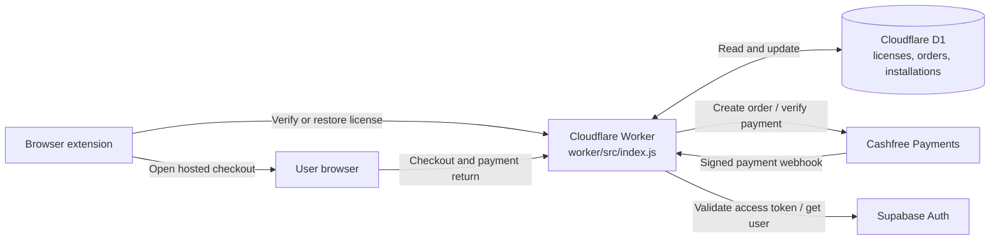
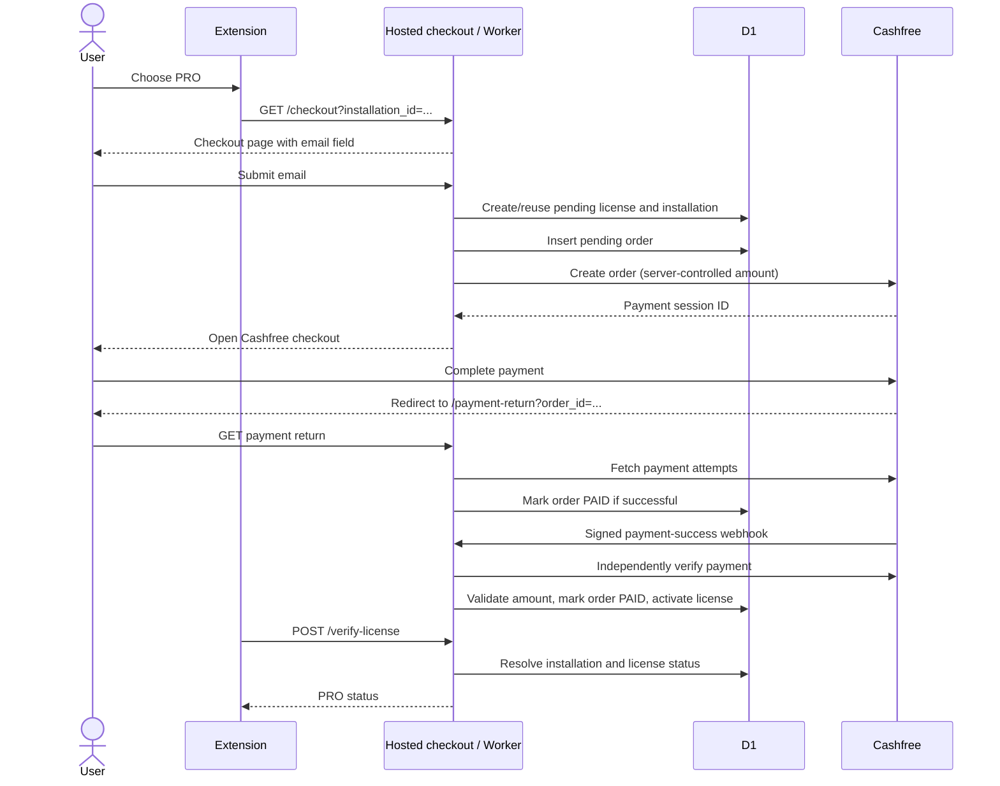
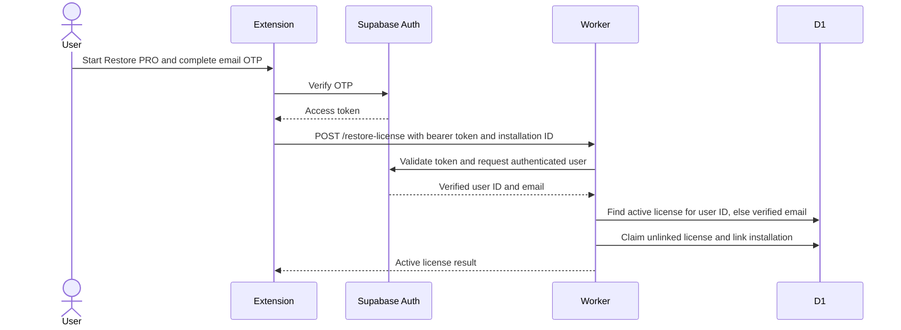

# KGP Placement Form Tracker Backend

Backend service for the KGP Placement Form Tracker browser extension. It runs as a Cloudflare Worker and provides hosted PRO checkout, payment confirmation, license verification, and license recovery.

## Contents

- [Overview](#overview)
- [Features](#features)
- [System Architecture](#system-architecture)
- [Purchase and Activation Flow](#purchase-and-activation-flow)
- [License Recovery Flow](#license-recovery-flow)
- [API Reference](#api-reference)
- [Data Model](#data-model)
- [Privacy-First Design](#privacy-first-design)
- [Security Notes](#security-notes)
- [Configuration and Development](#configuration-and-development)
- [Testing](#testing)

## Overview

The Worker is the boundary between the browser extension and the services needed to sell and restore PRO access:

- **Cloudflare Workers** handles HTTP requests, hosted checkout and license workflows.
- **Cloudflare D1** stores licenses, payment orders and browser installations.
- **Cashfree** creates payment sessions and provides authoritative payment status.
- **Supabase Auth** verifies a user's access token when they restore a purchase.

The purchase email is collected for payment and later recovery, but entering an email at checkout does not prove ownership. A user must authenticate through Supabase (the extension's OTP flow) before an active purchase can be claimed by an account.

## Features

- Health endpoint reports service status, payment mode, current PRO price and the extension's configured successful-verification cache duration.
- Hosted checkout at `/checkout` accepts an installation ID and collects an email before starting payment.
- Order creation validates the installation ID and email, creates or reuses a pending license, and prevents a second pending order for the same license during a 10-minute window.
- Cashfree payment sessions are created server-side; the server controls the amount.
- Payment return checks payment status with Cashfree and updates the local order when payment succeeds.
- A signed Cashfree webhook independently verifies successful payment, validates the expected amount and activates the license. Repeated success notifications are handled idempotently.
- License verification maps an installation ID to its license status and refreshes last-seen/last-verified timestamps.
- License recovery verifies a Supabase bearer token, finds an active license owned by that account or matching its verified email, and links the current installation.
- A license supports up to five installations by default. When a new installation is linked at capacity, the least recently seen installation is replaced.

## System Architecture



The Worker currently implements these routes in one entry point, [worker/src/index.js](worker/src/index.js). D1 is configured as `kgp_placement_form_tracker_db` in [worker/wrangler.jsonc](worker/wrangler.jsonc). The SQL table definitions are in [worker/migrations](worker/migrations).

## Purchase and Activation Flow



The browser return page is for user feedback and records the successful order status. License activation is performed by the verified webhook path; the extension can then verify the installation's status.

## License Recovery Flow



An installation already linked to a different license is not moved by recovery. A license already claimed by another Supabase user cannot be claimed again. At the installation limit, recovery replaces the least recently seen installation.

## API Reference

All paths are relative to the deployed Worker origin. JSON endpoints return JSON. Installation IDs must be strings between 10 and 200 characters.

| Method and path | Purpose | Request | Typical response |
| --- | --- | --- | --- |
| `GET /` | Health/configuration check | None | `status`, `service`, `mode`, `pro_price`, `license_cache_hours` |
| `GET /checkout?installation_id=...` | Hosted PRO checkout page | Installation ID query parameter | HTML checkout page; invalid IDs return `400` |
| `POST /create-order` | Create a Cashfree payment session | `{ "installation_id": "...", "email": "user@example.com" }` | `order_id`, `license_id`, `payment_session_id`; active installation returns `already_active`; recent pending order returns `409` |
| `GET /payment-return?order_id=...` | Check payment result after Cashfree redirects | Cashfree order ID query parameter | HTML success, pending, or failure status |
| `POST /payment-webhook` | Verify Cashfree event and activate entitlement | Cashfree webhook body and signature/timestamp headers | JSON confirmation; rejects missing, invalid, or stale signatures |
| `POST /verify-license` | Check PRO status for this installation | `{ "installation_id": "..." }` | `{ "success": true, "pro": true/false, "status": "..." }` |
| `POST /restore-license` | Claim/restore a purchase and link an installation | Bearer Supabase access token and `{ "installation_id": "..." }` | Active license and installation IDs; returns an error/status when no eligible license is found |

`/restore-license` requires `Authorization: Bearer <access-token>`. The token is validated with Supabase; the Worker does not trust a user ID or email supplied in the request body. The webhook requires Cashfree's `x-webhook-signature` and `x-webhook-timestamp` headers.

## Data Model

The schema separates entitlement, payment attempts and installations:

| Table | Stored information | Relationship |
| --- | --- | --- |
| `licenses` | License ID, optional Supabase user ID, checkout email, status, installation limit, creation/activation/verification timestamps | One entitlement can be linked to multiple installations and have multiple orders |
| `orders` | Cashfree order ID, associated license, payment ID, amount in paise, currency, status and payment timestamps | Each order belongs to one license |
| `installations` | Opaque installation ID, associated license and creation/last-seen timestamps | Each installation points to at most one license |

License statuses are `PENDING`, `ACTIVE` and `REVOKED`. Order statuses are `PENDING`, `PAID`, `FAILED` and `REFUNDED`. The current schema and indexes are in [worker/migrations/0002_payment_ready_license.sql](worker/migrations/0002_payment_ready_license.sql). Migration `0001` preserves/renames the earlier legacy license table; review migration history and the target database before applying migrations to a new or existing database.

## Privacy-First Design

This backend is designed to process only the information needed for payment and entitlement management:

- **No ERP data path:** ERP credentials, notice contents and placement-form data are not submitted to the payment backend. Checkout explicitly tells users this.
- **Email is not treated as proof:** Checkout email is stored for payment/recovery matching, but it cannot claim an active license on its own. Recovery requires a Supabase-verified session and uses the verified account email.
- **Opaque installation identifier:** License verification uses the extension's installation ID instead of requiring a user account for every routine check.
- **Minimal license records:** D1 stores entitlement state, payment references and timestamps, not the extension's placement-tracking content.
- **Payment data stays with the payment provider:** The Worker stores the Cashfree order/payment reference and amount/status, not card or bank details.
- **Account linking is explicit:** A license is claimed by Supabase user ID once a user proves account access; already-claimed ownership is not silently reassigned.
- **CORS is allowlisted:** Browser access is limited to the configured extension origin, Worker origin and local development origins. CORS is a browser policy, not user authentication.

The checkout email is retained in D1 as `customer_email`; a verified Supabase user ID is added when a license is claimed. This repository does not define a retention/deletion schedule, so one should be established operationally if required by the product's privacy commitments.

## Security Notes

- Cashfree credentials and the Supabase publishable key are read from Worker environment secrets, not hard-coded in the source.
- The Worker creates the Cashfree order and sets the amount from `PRO_PRICE_INR`; clients cannot choose the amount.
- Webhook signatures are HMAC-verified against the raw request body. Timestamps outside the five-minute acceptance window are rejected.
- A payment-success webhook is checked against Cashfree's payment API and the local order amount before the license is activated.
- The webhook activation path is idempotent for a license already marked active.
- `/verify-license` uses an installation ID and has no account bearer-token requirement. Treat installation IDs as identifiers, not as authentication secrets; successful responses are cached by the extension for the configured six-hour period.

## Configuration and Development

### Prerequisites

- Node.js compatible with the installed Wrangler/Vitest dependencies (Node.js 22 or later is recommended by the current dependency versions).
- A Cloudflare account with Workers and D1 access.
- Cashfree API credentials and a Supabase project configured for the extension's email OTP recovery flow.

### Install and run locally

```powershell
cd worker
npm install
npm run dev
```

Wrangler reads the Worker entry point and D1 binding from [worker/wrangler.jsonc](worker/wrangler.jsonc). The current D1 configuration sets `remote: true`, so local development may access the configured remote database; take care not to alter production data while testing.

### Worker secrets

Set these secrets in the Cloudflare Worker environment:

```powershell
npx wrangler secret put CASHFREE_APP_ID
npx wrangler secret put CASHFREE_SECRET_KEY
npx wrangler secret put SUPABASE_PUBLISHABLE_KEY
```

Do not commit secret values or place them in tracked source files. Wrangler's local secret file convention is `.dev.vars`; this repository's `worker/.gitignore` excludes it.

### Deployment and payment settings

```powershell
cd worker
npm run deploy
```

The current source configuration uses Cashfree's production API, checkout mode `production`, and a PRO price of INR 27.00. These values are defined near the top of [worker/src/index.js](worker/src/index.js). Confirm credentials, webhook URL/configuration, return URL, price, extension origin, and target D1 database before deployment. Do not assume the comments beside the price reflect its current value.

Migrations are in `worker/migrations`. Migration `0001` assumes an existing legacy `licenses` table to rename, and `0002` rebuilds the current tables. Confirm whether the target database has that legacy schema and inspect the migration state before applying; the configured database is remote.

## Testing

Run the worker tests from the `worker` directory:

```powershell
npm test -- --run
```

The current [worker/test/index.spec.js](worker/test/index.spec.js) contains the generated Hello World unit/integration snapshots and does not cover the payment, webhook, verification or recovery behavior described above. Replace/expand those scaffold tests before treating the critical flows as regression-tested.

## Repository Layout

```text
README.md
worker/
  migrations/          D1 schema migrations
  src/index.js         Cloudflare Worker routes and business logic
  test/index.spec.js   Vitest/Cloudflare test entry point
  package.json         Development, test and deploy scripts
  vitest.config.mjs    Cloudflare Workers Vitest configuration
  wrangler.jsonc       Worker and D1 configuration
```